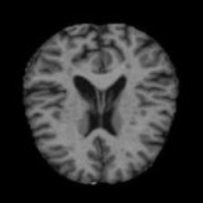

# alz-api

A modular REST API built with FastAPI, Docker, and Python for Alzheimer's disease classification, with deployment support on AWS EC2. While the initial focus is on MRI-based prediction, the system is being extended to support biomarkers and other clinical data sources.

## Status

**Development Stage**  
The current preliminary model achieves **91.25% test accuracy** on MRI classification. Further testing and enhancements are planned to improve the pipeline, expand data sources, and refine the methodology.

## Features

- CI/CD pipeline using GitHub Actions for automated Docker builds and testing
- RESTful API with FastAPI for Alzheimer’s stage classification
- Dockerized for reproducible local development and cloud deployment (AWS EC2)
- Support for multiple models:
  - **MobileNetV2** – Lightweight model; currently under training and deployable
  - **Vision Transformer (ViT)** – High-capacity model; untrained
- Modular design to support non-MRI data (e.g., biomarkers)
- Class-based PyTorch training, evaluation, and inference pipelines

## Requirements

- `requirements.txt` – Minimal dependencies for lightweight API deployment
- `environment.yml` – Full development setup (training, evaluation, etc.)

## Preview



## Usage

### Development (Local)

```bash
# Clone the repository
git clone https://github.com/SergeAlhalbi/alz-api.git
cd alz-api

# Set up the environment
conda env create -f environment.yml
conda activate alz-env

# Train, evaluate, and run inference
python scripts/mri/train.py
python scripts/mri/evaluate.py
python scripts/mri/inference.py

# Launch the API locally
uvicorn app.main:app --reload
```

### Deployment (Docker / AWS EC2)

```bash
# Pull and run the Docker container
docker pull sergealhalbi/alz-api:latest
docker run -d -p 8000:8000 sergealhalbi/alz-api:latest
```

Visit the API docs at: [http://localhost:8000/docs](http://localhost:8000/docs)

> For hosted EC2 access, please contact **Serge Alhalbi** to request instance availability.

## Citation

This project uses the publicly available [Alzheimer MRI Dataset](https://huggingface.co/datasets/Falah/Alzheimer_MRI):

```bibtex
@dataset{alzheimer_mri_dataset,
  author = {Falah.G.Salieh},
  title = {Alzheimer MRI Dataset},
  year = {2023},
  publisher = {Hugging Face},
  version = {1.0},
  url = {https://huggingface.co/datasets/Falah/Alzheimer_MRI}
}
```

## Notes

Model weights are excluded from version control but automatically pulled from GitHub Releases during Docker deployment. For local development, either:
- Train a model with `scripts/mri/train.py`, or
- Manually download weights from the [GitHub Releases](https://github.com/SergeAlhalbi/alz-api/releases) page.

## Author

**Serge Alhalbi**

---

*This repository is not affiliated with any organization. It is under active development.*

## Future Work

- **Train and deploy Vision Transformer (ViT)** – Complete training, tuning, and evaluation for deployment.
- **Multi-modal support** – Integrate biomarkers, demographics, and other clinical data.
- **Model explainability** – Add Grad-CAM or SHAP for interpretable predictions.
- **AutoML tools** – Integrate hyperparameter optimization for faster experimentation.
- **Frontend UI** – Develop a simple web interface for image upload and visualization.
- **API hardening** – Add authentication, logging, error handling, and production optimizations.
- **Mobile/Edge deployment** – Optimize MobileNetV2 for low-power devices (quantization/pruning).
- **Dataset expansion** – Improve generalization with diverse and larger datasets.